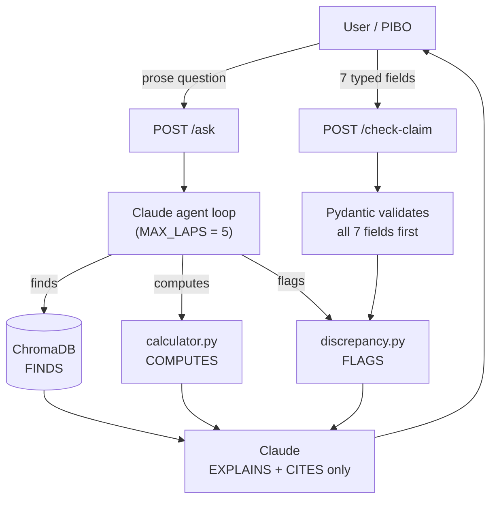

# EPR Co-pilot

**An AI compliance-and-trust assistant for India's plastic-EPR market.**
It answers EPR questions with citations to the real CPCB regulations, computes
obligations with a deterministic calculator (never the language model), and —
its headline capability — **detects discrepancies in recycling claims** that
don't add up against real-world physical capacity.

> 🔗 **Live demo:** https://epr-copilot-latest.onrender.com
> *(Free tier — the first request after idle takes ~1 min to wake up. Demo runs
> on synthetic claim data only; no real recycler data or PII.)*

---

## Why this exists

In 2023, India's EPR market suffered a fraud crisis at scale: the CPCB found
**700,000+ fake recycling certificates**, with claimed tonnage running up to
**38× over recyclers' real physical capacity**, and **₹355 Cr in fines**.
A brand that buys a fake certificate inherits the liability — so the open
question is no longer *"how do we track compliance"* but *"how does anyone
trust a recycling claim again?"*

Tracking compliance is already a solved, crowded space. The unsolved,
board-level problem is **verification** — and that's what this project targets.

*(Source: CPCB audit 2023 / CSE report via Down To Earth, Oct 2024.)*

---

## What it does

1. **Grounded Q&A (RAG)** — answers EPR questions with citations to the actual
   CPCB regulations, and refuses to guess when it can't cite a source.
2. **Deterministic obligation calculator** — a pure function computes recycling
   obligations; the model calls it as a tool and never invents the number.
3. **Discrepancy detection (the headline)** — given a claim packet, it runs
   three deterministic checks and flags claims that don't add up:
   - **Capacity-plausibility** — does claimed tonnage exceed registered capacity? *(the 38× pattern)*
   - **Material balance** — do inputs roughly equal outputs minus expected process loss?
   - **Cross-document consistency** — do figures, dates, and names agree across the packet?

---

## The core idea: the trust boundary

The one design decision the whole product rests on:

> **Code decides. Claude explains.**

Deterministic code renders every verdict; the language model only narrates
*why* a check fired, with citations. A claim is never marked "plausible" unless
the deterministic checks actually ran and returned a value. That's the line
between "we used an LLM" and an **audit-grade** verification tool.



**Two doors, on purpose:** `/ask` (prose, convenient — Claude extracts numbers
from a sentence) and `/check-claim` (structured, audit-grade — Pydantic
validates all 7 fields *before any code runs*). The convenient path is not the
trustworthy path, so both are kept deliberately.

---

## Run it yourself

**Easiest — just use the live demo:** open the URL above and try the two panels.

**Reproducible — pull the public Docker image** (the vector store is baked in,
so it works out of the box):

```bash
docker run -p 8000:8000 -e ANTHROPIC_API_KEY=sk-ant-your-key \
  rithiesathulya26/epr-copilot:latest
# then open http://localhost:8000  (after adding the GET "/" route — see note below)
```

**From source** (most work — the vector store, ONNX model, and source PDFs are
git-ignored, so you rebuild the index):

```bash
git clone https://github.com/Rithies/epr-copilot.git
cd epr-copilot
python3 -m venv venv && source venv/bin/activate   # Windows: venv\Scripts\activate
pip install -r requirements.txt
echo "ANTHROPIC_API_KEY=sk-ant-your-key" > .env

# rebuild the vector store from the CPCB PDFs you place in regulations/
python ingest.py        # chunk the PDFs
python embed.py         # embed chunks into ChromaDB

uvicorn main:app --reload
# then open index.html in your browser
```

---

## API

**`POST /ask`** — prose question; returns a cited answer (or a refusal), the
sources, the tool used, and the cost in INR.

```bash
curl -X POST https://epr-copilot-latest.onrender.com/ask \
  -H "Content-Type: application/json" \
  -d '{"text": "What is the recycling target for Category I plastic in 2024-25?"}'
```

**`POST /check-claim`** — the structured, audit-grade door. Send the 7 typed
fields of a claim packet; Pydantic validates every type *before any code runs*.
Returns a verdict (`flagged` / `plausible`), the list of checks that fired, and
the exact reason for each.

```bash
curl -X POST https://epr-copilot-latest.onrender.com/check-claim \
  -H "Content-Type: application/json" \
  -d '{
        "recycler_id": "REC-042",
        "registered_capacity_t": 100,
        "claimed_recycled_t": 3800,
        "input_t": 200,
        "output_t": 180,
        "cert_year": 2024,
        "registration_year": 2023
      }'
```

This example claims 3,800 t recycled against a 100 t registered capacity (38×) —
so the capacity check fires and the verdict comes back `flagged`, with the
reason spelled out. The verdict is rendered entirely by deterministic code;
Claude is not involved on this endpoint at all.

---

## How do we know it works?

Backed by an evaluation harness:

| Metric | Result |
|---|---|
| Discrepancy detection (precision / recall) | 100% / 100% on the synthetic golden set |
| Calculation correctness | 19 / 19 on the target test set |
| Cost per query | ₹0.23 – ₹1.5 by lane |
| Median latency | ~3.6 s |

> ⚠️ **Honest caveat:** the 100%/100% is a *warning sign as much as a win*. The
> checks and the synthetic data generator were written with matching logic, so a
> perfect score proves **internal consistency, not real-world robustness**
> ("teaching to the test"). Real coverage needs adversarial cases and, eventually,
> real claim data. Naming this is the point — a metric you can't defend is a
> liability, not an asset.

---

## Tech stack

Python · FastAPI · Anthropic Claude (`claude-sonnet-4-6`) · ChromaDB
(local PersistentClient, MiniLM embeddings, 173 CPCB regulation chunks) ·
Docker (linux/amd64) · deployed on Render.

---

## Known limitations & deferred work

Tracked honestly, not hidden:

- Capacity check uses a strict `>` — a claim exactly at the ceiling passes.
- `/ask` can editorialize plausibility before a check runs if fields are missing;
  the structured `/check-claim` door cannot (Pydantic validates first).
- `chroma_db/` is baked into the Docker image, so updating regulations needs a
  rebuild. Production pattern = a hosted vector DB (Pinecone / pgvector).
- v1 uses **synthetic data only** — no real recycler data, no PII.
- Deferred for v1: knowledge-graph ring detection, task-queue + worker pool for
  long agent runs, Postgres/Redis audit-trail store, Langfuse tracing, CI/CD.

---

## Repo structure

| File | Purpose |
|---|---|
| `main.py` | FastAPI app: `/ask` (agent, 2 tools) + `/check-claim` (structured) |
| `index.html` | Two-panel UI (Q&A + Claim Checker), plain `fetch`, no frameworks |
| `calculator.py` | Pure obligation calculator (CPCB targets sourced inline) |
| `discrepancy.py` | The three deterministic check functions |
| `synthetic_data.py` | Labelled claim-packet generator |
| `evaluate.py` · `eval_faithfulness.py` · `eval_cite_or_refuse.py` | Eval harness |
| `test_calculator.py` · `test_tools.py` | Unit / tool-use tests |
| `metrics.py` · `cost.py` | Metrics dashboard + per-query cost |
| `ingest.py` · `embed.py` · `retrieve.py` | RAG pipeline (chunk → embed → query) |
| `Dockerfile` · `docker-compose.yml` | Containerisation |

---

*Built as a portfolio project — a single-container demo, architected like the
real thing scaled down: a deterministic trust boundary, a bounded agent loop,
cost tracking, and an eval harness.*
